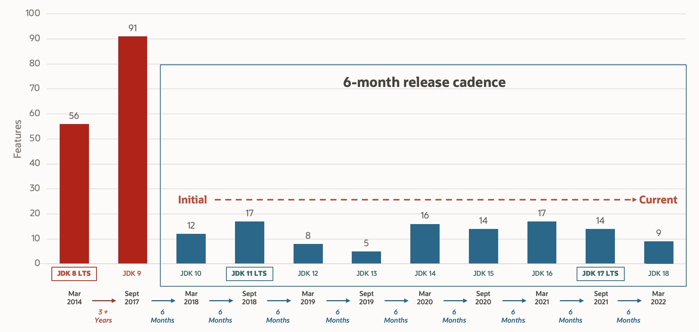

= java 17
:toc:
:toc-placement: left
:toclevels: 1
:showtitle:
:toc-title: pass:[<b>Contenus</b>]

// Need some preamble to get TOC:
{empty}

ifndef::env-github[]
[.text-center]
image::./images/logo.png[]
endif::[]

== Release

Septembre 2021

== Applet (marqué comme à supprimer)

Oh ! toi aussi tu as commencé ta carrière il y a beaucoup d’années :) et tu as appris à utiliser les Applet java dans ton navigateur.

Une feature qui est marqué comme à supprimer ce qui signifie que dans les versions futures, les applets ne feront plus parti de Java, étant donné que plusieurs navigateurs ont déjà dépréciés cette feature.

== Classe `Sealed`

**Introduction** : Java 15

**Release** : Java 17

En Java, il n’y a pas de contrôle fin sur l’héritage.

Nous connaissons seulement les modifiers : public, protected, private, default package.

Le mot clé `sealed` permet de définir quel type pourrait être utilisé comme sous-type.

Ce mot clé permet de définir une hiérarchie finit et c’est son plus grand bénéfice.

Il est doit être utilisé avec le mot clé `permits`.

[source, java]
----
package com.training.java.sealedclasses;

public abstract sealed class Person permits Employer, Manager {
}
----

[source, java]
----
package com.training.java.sealedclasses;

public non-sealed class Manager extends Person {
}
----

== Feature supprimées

=== Security Manager

== LTS

Release tous les 6 mois désormais.

Support étendu de plusieurs années.

LTS java 11 (2018)

LTS java 17 (septembre 2021)

L’écart entre 2 LTS est de 2 ans au lieu de 3.

Java 21 (2023) sera probablement la future version LTS.

