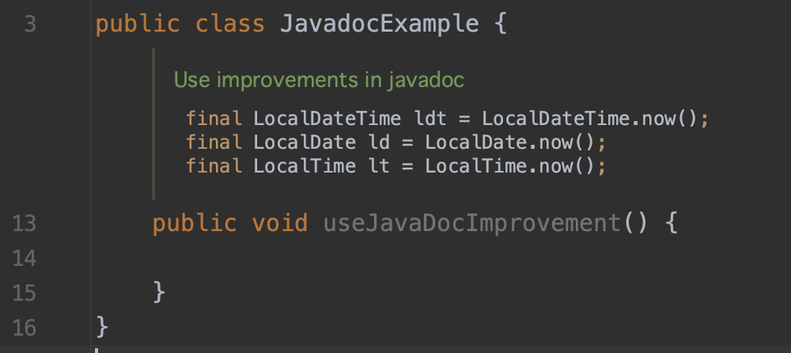
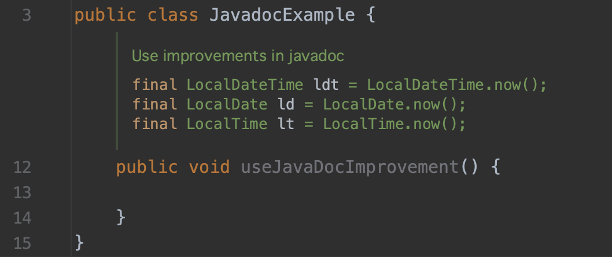
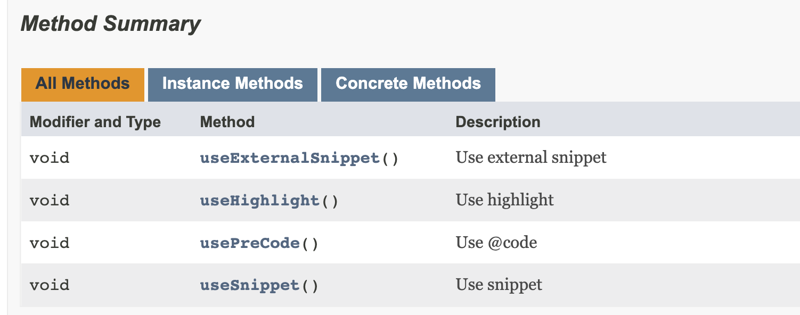
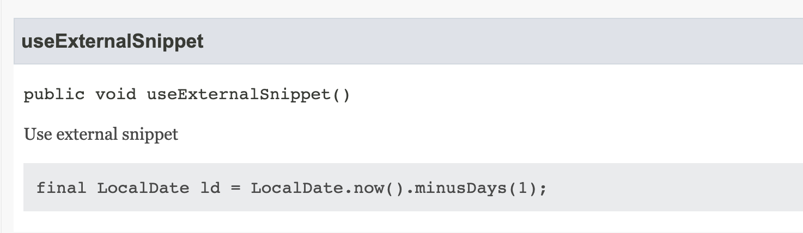
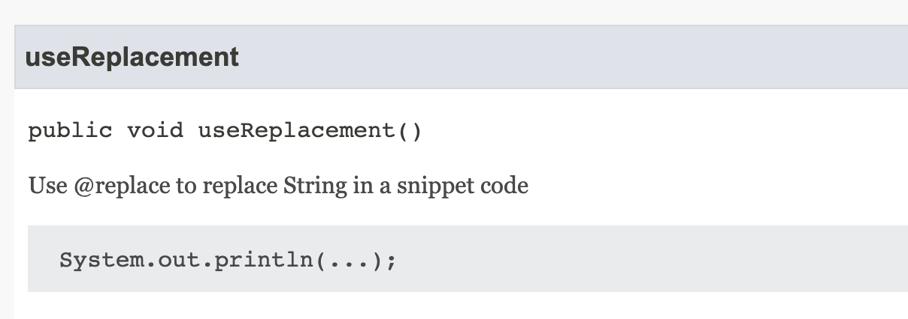

= java 18
:toc:
:toc-placement: left
:toclevels: 1
:showtitle:
:toc-title: pass:[<b>Contenus</b>]

// Need some preamble to get TOC:
{empty}

ifndef::env-github[]
[.text-center]
image::./images/logo.png[]
endif::[]

== Release

Mars 2022

== Simple web server

[source]
----
jwebserver
----

Par défaut c’est le répertoire courant de cette ligne de commande qui est affiché.

http://localhost:8000

Modifier le port

[source, shell]
----
jwebserver -p 8080
----

Requête `HEAD` et `GET` uniquement

Sinon erreur HTTP 501 not implemented

HTTP 1.1

Pas de HTTPS

Logs dans la console (modifiable via `l’option -o`

Options

[source]
----
~ jwebserver -h
Usage: jwebserver [-b bind address] [-p port] [-d directory]
                  [-o none|info|verbose] [-h to show options]
                  [-version to show version information]
Options:
-b, --bind-address    - Address to bind to. Default: 127.0.0.1 (loopback).
                        For all interfaces use "-b 0.0.0.0" or "-b ::".
-d, --directory       - Directory to serve. Default: current directory.
-o, --output          - Output format. none|info|verbose. Default: info.
-p, --port            - Port to listen on. Default: 8000.
-h, -?, --help        - Prints this help message and exits.
-version, --version   - Prints version information and exits.
To stop the server, press Ctrl + C.
----

== UTF-8 par défaut

Pour la lecture/écriture de fichiers et pour le traitement du texte, l’api java permet de passer un jeu de caractères tel que

- UTF-8
- ISO-8859-1
- etc…

UTF-8 par défaut pour harmoniser le comportements sur tous les OS, les locales ou la configuration.

Le jeu de caractères dépend de la locale, de l’OS.

== Code snippet dans la javadoc (JEP 413)

avec l’annotation `@code`

[source]
----
/**
 * 
Use improvements in javadoc

 *
 * <pre>{@code
 * final LocalDateTime ldt = LocalDateTime.now();
 * final LocalDate ld = LocalDate.now();
 * final LocalTime lt = LocalTime.now();
 * }</pre>
 */
----

Avec intellij et son mode reader de la Javadoc

Avec la nouvelle annotation `@snippet`

[source, java]
----
package com.training.java.javadoc;

public class JavadocExample {
    /**
     * 
Use improvements in javadoc

     * {@snippet :
     * final LocalDateTime ldt = LocalDateTime.now();
     * final LocalDate ld = LocalDate.now();
     * final LocalTime lt = LocalTime.now(); // @highlight substring="LocalTime"
     *}
     */
    public void useJavaDocImprovement() {

    }
}
----

Mode reader sur Intellij

=== External snippet

Il est possible d’afficher un snippet de code, un fragment de code qui se trouve dans une autre classe ce qui permet d’écrire des exemples de code dans des fichiers séparés.

`@snippet region`

`@start region`

`@end`

[source, java]
----
package com.training.java.javadoc;

/**
 * Default javadoc in class level
 */
public class JavadocExample {
    /**
     * 
Use external snippet

     * {@snippet class = "JavadocExternalExample" region = "example"}
     */
    public void useExternalSnippet() {
    }
}
----

Code du fichier `JavadocExternalExample.java`

[source, java]
----
package com.training.java.javadoc;

import java.time.LocalDate;

/**
 * Comment in level class
 */
public class JavadocExternalExample {
    /**
     * Default javadoc in constructor
     */
    public JavadocExternalExample() {
    }

    /**
     * Default comment
     */
    public void useExternalSnippet() {
        // @start region="example"
        final LocalDate ld = LocalDate.now().minusDays(1);
        // @end
    }
}
----

Par défaut, lors de la génération de la javadoc, le fichier JavadocExternalExample doit se trouver dans le répertoire snippet-files.

Le problème avec ce nommage est qu’un nom de package avec un ‘-’ n’est pas génial.

On va utiliser Maven et le plugin maven-javadoc-plugin avec l’option —snippet-path pour spécifier le path des snippet externes

Fichier pom.xml

[source, xml]
----
<build>
    <plugins>
        <plugin>
            <groupId>org.apache.maven.plugins</groupId>
            <artifactId>maven-javadoc-plugin</artifactId>
            <executions>
                <execution>
                    <id>attach-javadocs</id>
                    <goals>
                        <goal>jar</goal>
                    </goals>
                    <configuration>
                        <additionalOptions>
                            <additionalOption>
                                --snippet-path=${basedir}/src/main/java/com/training/java/javadoc/snippet
                            </additionalOption>
                        </additionalOptions>
                    </configuration>
                </execution>
            </executions>
        </plugin>
    </plugins>
</build>
----

Test

[source]
----
mvn package
----

Résultat

=== Replace

Permet de remplacer du code par d’autres caractères

[source, java]
----
package com.training.java.javadoc;

/**
 * Default javadoc in class level
 */
public class JavadocExample {
    /**
     * 
Use @replace to replace String in a snippet code

     * {@snippet :
     * System.out.println("Hello world !"); // @replace regex='".*"' replacement="..."
     *}
     */
    public void useReplacement() {
        System.out.println("Hello world !"); // @replace regex='".*"' replacement="..."
    }
}
----

Résultat

=== Link to a java API

Faire une liaison avec la javadoc officielle

[source, java]
----
package com.training.java.javadoc;

/**
 * Default javadoc in class level
 */
public class JavadocExample {
    /**
     * Use link to reference a java API
     * {@snippet :
     * final LocalTime lt = LocalTime.now(); // @link substring="LocalTime" target="java.time.LocalTime"
     *}
     */
    public void useLinkText() {
    }
}
----

=== Use properties files

Référencer des properties d’un fichier properties externes

[source, java]
----
package com.training.java.javadoc;

/**
 * Default javadoc in class level
 */
public class JavadocExample {
    /**
     * Use properties file in a code snippet
     * {@snippet file = "config.properties"}
     */
    public void usePropertiesFile() {
    }
}
----

=== Use properties

Ecrire directement des properties dans un snippet

[source, java]
----
package com.training.java.javadoc;

/**
 * Default javadoc in class level
 */
public class JavadocExample {
		/**
     * Use properties in a code snippet
     * {@snippet lang = properties:
     * local.timezone=PST
     * local.zip=94123
     *}
     */
    public void useProperties() {
    }
}
----

### Les tags des snippet

**Attribut de @snippet**

* `class` : une class qui contient le snippet
* `file` : un fichier qui contient le snippet
* `id` : un identifiant
* `lang` : la langue ou le format du snippet
* `region` : un fragment de code à afficher

**Markup tags**

* `start` : marque le début d’une région
** `region` : le nom d’une région
* `end` : marque la fin d’une région
** `region` : la nom d’une région
* `highlight` : surligner du code
** `substring` : le texte à surligner
** `regex` : une expression régulière pour le texte à surligner
** `region` : une région dans lequel on trouve le texte
** `type` : le type de surlignage : bold, italic, highlighted
* `replace` : remplacer le texte dans une ligne ou une région
** `substring` : le texte à remplacer
** `regex` : une expression régulière pour le texte à surligner
** `region` : une région dans lequel on trouve le texte
** `replacement` : le text de remplacement
* `link` : lien dans une ligne ou une région
** `substring` : le texte à remplacer
** `regex` : une expression régulière pour le texte à surligner
** `region` : une région dans lequel on trouve le texte
** `target` : la cible du lien
** `type` : type de lien

== Pattern Matching avec switch

**feature** : en preview

De même que le pattern matching avec l’instruction `instance of`, l’instruction case va permettre de réaliser une conversion automatique et d’assigner une valeur à une valeur directement au côté de l’instruction `case`.

[source, java]
----
package com.training.java.switchpatternmatching;

public class SwitchExample {
    int usePatterMatching(final Shape shape) {
        return switch (shape) {
            case null -> -1;
            case Rectangle rectangle -> rectangle.getSides();
            case Triangle triangle -> triangle.getSides();
        };
    }
}
----

Les POJOS de l’exemple

[source, java]
----
package com.training.java.switchpatternmatching;

public abstract sealed class Shape permits Triangle, Rectangle {
    abstract int getSides();
}
----

[source, java]
----
package com.training.java.switchpatternmatching;

public final class Rectangle extends Shape {
    @Override
    int getSides() {
        return 4;
    }
}
----

[source, java]
----
package com.training.java.switchpatternmatching;

public final class Triangle extends Shape {
    @Override
    int getSides() {
        return 3;
    }
}
----

On constate :

- la possibilité de définir le case `null` et les hostilités pour les valeurs `null`
- Définir une variable (ici `rectangle` et `triangle`) utilisable dans les instructions du cas à traiter
- Tous les cas sont couverts. Pas besoin du cas `default` cas la hiérarchie des objets `Shape`, `Rectangle`, `Triangle` est complète dans les différentes instructions `case`.

=== Des conditions dans les `case`

Possibilité de définir des conditions dans les différents cas.

[source, java]
----
package com.training.java.switchpatternmatching;

public class SwitchExample {
    /**
     * use switch case and conditions in the case instruction
     *
     * @param shape {@link Shape}
     * @return a joke
     */
    String useConditionInCase(final Shape shape) {
        switch (shape) {
            case Triangle triangle && triangle.getSides() == 3 -> {
                return "Yes of course. My name's Triangle and i have three sides";
            }
            default -> throw new IllegalStateException("Unexpected value: " + shape);
        }
    }
}
----

Test

[source, java]
----
package com.training.java.switchpatternmatching;

import org.junit.jupiter.api.Assertions;
import org.junit.jupiter.api.BeforeEach;
import org.junit.jupiter.api.Test;

class SwitchExampleTest {
    private SwitchExample switchExample;

    @BeforeEach
    void setUp() {
        switchExample = new SwitchExample();
    }

    @Test
    void useConditionInCase() {
        final String joke = "Yes of course. My name's Triangle and i have three sides";
        Assertions.assertEquals(joke, switchExample.useConditionInCase(new Triangle()));
    }
}
----

Check des types pour l’instruction case

Dans cet exemple

[source, java]
----
package com.training.java.switchpatternmatching;

public class SwitchExample {
    int usePatterMatching(final Shape shape) {
        return switch (shape) {
            case null -> -1;
            case Rectangle rectangle -> rectangle.getSides();
            case Triangle triangle -> triangle.getSides();
        };
    }
}
----

Rectangle et Triangle sont compatibles avec l’objet de type Shape (hiérarchie)

Que se passe t-il si j’écris ?

[source, java]
----
package com.training.java.switchpatternmatching;

public class SwitchExample {
	int usePatterMatchingWrongType(final Shape shape) {
	    return switch (shape) {
	        case String s -> -1; // Compilation error
	        case Rectangle rectangle -> rectangle.getSides();
	        case Triangle triangle -> triangle.getSides();
	    };
	}
}
----

[source]
----
case String s -> -1;
----

Le type String n’est pas compatible avec l’objet de type Shape.

Il y a donc une erreur à la compilation.

[IMPORTANT]
====

[red]#**Required type: Shape,
Provided: String**#

====

Tous les cas doivent être compatible avec l’élément référencé dans l’instruction `switch`.

=== Dominance de type

L’ordre des case est important et doit être du plus spécifique au plus générique dans une grappe d’objet.

[source, java]
----
package com.training.java.switchpatternmatching;

public class SwitchExample {
	int usePatterMatchingWithDominanceType(final Shape shape) {
      return switch (shape) {
          case Object ignored -> -1; // Compilation error
          case Rectangle rectangle -> rectangle.getSides();
          case Triangle triangle -> triangle.getSides();
      };
  }
}
----

[red]#**Erreur !**#

[IMPORTANT]
====

[red]#**Label is dominated by a preceding case label 'Shape shapeCase'**#

====

[red]#**Même erreur si un un cas test une valeur null**#

[source, java]
----
package com.training.java.switchpatternmatching;

public class SwitchExample {
	int usePatterMatchingWithDominanceType(final Shape shape) {
	    return switch (shape) {
	        case Object o -> -1;
	        case null -> -1; // Compilation Error
	        case Rectangle rectangle -> rectangle.getSides();
	        case Triangle triangle -> triangle.getSides();
	    };
	}
}
----

Correction

[source, java]
----
package com.training.java.switchpatternmatching;

public class SwitchExample {
	int usePatterMatchingWithDominanceType(final Shape shape) {
      return switch (shape) {
          case Rectangle rectangle -> rectangle.getSides();
          case Triangle triangle -> triangle.getSides();
          case null, Object ignored -> -1;
      };
  }
}
----

=== Avec des génériques

Compile avec Maven

Ne compile pas sur Intellij IDEA EAP 2022.2

[IMPORTANT]
====

[red]#**'switch' expression does not cover all possible input values**#

====

Les différents cas du switch sont couvert car

- le paramètre `interf` est de type `Container<Integer>`. Le générique est de type `Integer`
- De ce fait, le seul cas à couvrir est le type `ConteneurGenerique<Integer>`

[source, java]
----
package com.training.java.switchpatternmatching;

public class SwitchExample {
	sealed interface Container<T> permits ConteneurChaine, ConteneurGenerique {
	}

	final class ConteneurChaine<T> implements Container<String> {
	}

	final class ConteneurGenerique<T> implements Container<T> {
	}

	int usePatternMatchingCoverAllCases(final Container<Integer> interf) {
	    return switch (interf) {
	        case ConteneurGenerique<Integer> conteneurGenerique -> 42;
	    };
	}
}
----
