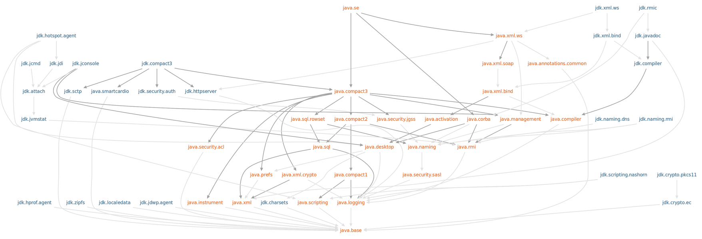

= java 9
:toc:
:toc-placement: left
:toclevels: 1
:showtitle:
:toc-title: pass:[<b>Contenus</b>]

// Need some preamble to get TOC:
{empty}

ifndef::env-github[]
[.text-center]
image::./images/logo.png[]
endif::[]

== Release

Septembre 2017

== Jigsaw

Java Platform Module System (JPMS) au dessus des packages Java.

1 module = un groupe de packages avec un fichier de description.

Description d'un module :

- **name** : Le nom du module
- **dependencies** : la liste des autre modules dont dépend notre module
- **public packages** : la liste des packages accessible en dehors du module
- **services offered** : founit l'implémentation des services qui peuvent être consommés par les autres modules
- **services consumed** : permet au module courant d'être consommateur d'un service
- **reflection permissions** : permet aux autres classes d'utiliser la réflection pour accéder aux membres private du package

**Par défaut** : tous les packages du module sont **private**.

=== 4 types de modules

- **system module** : ce sont les modules listés quand vous utilisez la commande `list-modules`. Cela inclut les modules Java SE et JDK.
- **Application module** : Ce sont les modules que vous décidez de builder quand on utilise la notion de modules. Ils sont nommés et définis dans la classe compilée `module-info.class` inclus dans le JAR buildé.
- **Automatic module** : inclusion de modules non officiels en ajoutant un fichier de description d'un module au path du module.
- **Unnamed module** : Quand une classe ou un JAR est chargé à partir du classpath et non du path du module, il est ajouté au module unnamed module.

=== Définition d’un module et mots clés

- fichier `module-info.java`
- `module` : mot clé de départ dans le fichier de configuration
- `requires + module-name` : si le module dépend d’un autre module, utiliser ce mot clé + le nom du module dont dépend le module courant
- `requires transitive + module-name` : spécifie que chaque module qui dépend du module précisant `requires transitive + module-name` récupère une dépendance implicite du module-name.
- `exports + package` : package public visible des autres modules
- `exports <package> to <module>` : pour rendre publique un package mais uniquement à tel ou tel module
- `opens + package` : packages accessibles uniquement au runtime et par introspection. Peut-être utilisé au niveau module, et dans ce cas, le module complet est uniquement accessible au runtime.
- `opens <package> to <module>, <module>` : packages accessibles uniquement au runtime et par introspection pour tel ou tel module.
- `uses + class/interface` : indique l’interface/classe que le module utilisera
- `provides <interface> with <implementation>` : pour préciser l’implémentation fournit ainsi que son interface

=== Création de l’exemple

Sur intellijIDEA, aucun répertoire ne doit être définit comme contenant des sources sinon se produit l’erreur de duplication de la définition d’un module (fichier module-info.java)

*Structure simple*

[source, shell]
----
tree
----

[source]
----
.
├── compile-single-modules.sh
├── pom.xml
├── run-helloimpl.sh
├── src
│   └── single-modules
│       ├── consumeapi
│       │   ├── com
│       │   │   └── training
│       │   │       └── java
│       │   │           └── consumeapi
│       │   │               └── ConsumeApi.java
│       │   └── module-info.java
│       ├── services
│       │   ├── com
│       │   │   └── training
│       │   │       └── java
│       │   │           └── hello
│       │   │               └── Hello.java
│       │   └── module-info.java
│       └── servicesimpl
│           ├── com
│           │   └── training
│           │       └── java
│           │           └── serviceimpl
│           │               └── HelloImpl.java
│           └── module-info.java
----

`target` : répertoire où sera compilé les sources

Pour lancer notre Hello world,

- compiler les sources : `./compile-single-modules.sh`
- Lancer le programme : `run-helloimpl.sh`

La compilation

[source, shell]
----
#!/bin/sh
javac -d target \
  --module-source-path src/single-modules \
  $(find src/single-modules/consumeapi -name "*.java")

javac --module-path target -d target/services \
  src/single-modules/services/module-info.java \
  src/single-modules/services/com/training/java/hello/Hello.java

javac --module-path target -d target/servicesimpl \
  src/single-modules/servicesimpl/module-info.java \
  src/single-modules/servicesimpl/com/training/java/serviceimpl/HelloImpl.java
----

`—module-path + <répertoire>` :

- Java 9 se débarrasse de la notion de classpath et fournit la notion de module path
- Le path est l’emplacement où le module peut être découvert
- utilisation de l’option `—module-path <répertoire>`

=== Modules de la JDK

.Lister les modules de la JDK
[%collapsible]
====
[source, shell]
----
➜  java9-jigsaw git:(master) ✗ java --list-modules
java.base@18.0.1.1
java.compiler@18.0.1.1
java.datatransfer@18.0.1.1
java.desktop@18.0.1.1
java.instrument@18.0.1.1
java.logging@18.0.1.1
java.management@18.0.1.1
java.management.rmi@18.0.1.1
java.naming@18.0.1.1
java.net.http@18.0.1.1
java.prefs@18.0.1.1
java.rmi@18.0.1.1
java.scripting@18.0.1.1
java.se@18.0.1.1
java.security.jgss@18.0.1.1
java.security.sasl@18.0.1.1
java.smartcardio@18.0.1.1
java.sql@18.0.1.1
java.sql.rowset@18.0.1.1
java.transaction.xa@18.0.1.1
java.xml@18.0.1.1
java.xml.crypto@18.0.1.1
jdk.accessibility@18.0.1.1
jdk.attach@18.0.1.1
jdk.charsets@18.0.1.1
jdk.compiler@18.0.1.1
jdk.crypto.cryptoki@18.0.1.1
jdk.crypto.ec@18.0.1.1
jdk.dynalink@18.0.1.1
jdk.editpad@18.0.1.1
jdk.hotspot.agent@18.0.1.1
jdk.httpserver@18.0.1.1
jdk.incubator.foreign@18.0.1.1
jdk.incubator.vector@18.0.1.1
jdk.internal.ed@18.0.1.1
jdk.internal.jvmstat@18.0.1.1
jdk.internal.le@18.0.1.1
jdk.internal.opt@18.0.1.1
jdk.internal.vm.ci@18.0.1.1
jdk.internal.vm.compiler@18.0.1.1
jdk.internal.vm.compiler.management@18.0.1.1
jdk.jartool@18.0.1.1
jdk.javadoc@18.0.1.1
jdk.jcmd@18.0.1.1
jdk.jconsole@18.0.1.1
jdk.jdeps@18.0.1.1
jdk.jdi@18.0.1.1
jdk.jdwp.agent@18.0.1.1
jdk.jfr@18.0.1.1
jdk.jlink@18.0.1.1
jdk.jpackage@18.0.1.1
jdk.jshell@18.0.1.1
jdk.jsobject@18.0.1.1
jdk.jstatd@18.0.1.1
jdk.localedata@18.0.1.1
jdk.management@18.0.1.1
jdk.management.agent@18.0.1.1
jdk.management.jfr@18.0.1.1
jdk.naming.dns@18.0.1.1
jdk.naming.rmi@18.0.1.1
jdk.net@18.0.1.1
jdk.nio.mapmode@18.0.1.1
jdk.random@18.0.1.1
jdk.sctp@18.0.1.1
jdk.security.auth@18.0.1.1
jdk.security.jgss@18.0.1.1
jdk.unsupported@18.0.1.1
jdk.unsupported.desktop@18.0.1.1
jdk.xml.dom@18.0.1.1
jdk.zipfs@18.0.1.1
----
====

== new HTTP client

En java 9, le nouveau client HTTP est au sein du module jdk.incubator.httpclient et ne sera stable qu’à partir de Java 11.

[source, shell]
----
➜  java --list-modules | grep httpclient
jdk.incubator.httpclient@9.0.4
----

On va utiliser une ressource REST de test exposée par l’outil Postman

[source]
----
https://postman-echo.com/get
----

=== Installation du certificat HTTPS au sein de notre JVM

1. Récupérer le certificat en local : fichier rootca1.cer. Il s’agit du certificat intermédiaire du site postman-echo.com

2. Utilisation de l’outil keytool de la JDK pour importer le certificat dans le keystore de la JVM

[source, shell]
----
keytool -importcert -file /Users/matt/Downloads/dl/rootca1.cer \
  -keystore ~/.sdkman/candidates/java/9.0.4-open/lib/security/cacerts \
  -alias amazon-root-ca1
----

Faire confiance au certificat : oui

Le mot de passe par défaut d’un keystore est `changeit`

Exemple

Fichier pom.xml pour utiliser jackson-databind et mappé la réponse JSON avec un POJO Java

[source, xml]
----
<dependency>
    <groupId>com.fasterxml.jackson.core</groupId>
    <artifactId>jackson-databind</artifactId>
</dependency>
----

[source, java]
----
package com.training.java.httpclient;

import com.fasterxml.jackson.databind.ObjectMapper;
import jdk.incubator.http.HttpClient;
import jdk.incubator.http.HttpRequest;
import jdk.incubator.http.HttpResponse;

import java.io.IOException;
import java.net.URI;
import java.net.URISyntaxException;

public class HttpClientExample {
    public PostmanEchoResponse getPostmanEcho()
        throws URISyntaxException, IOException, InterruptedException {
        final HttpRequest httpRequest = HttpRequest.newBuilder()
                .uri(new URI("https://postman-echo.com/get"))
                .GET()
                .build();

        final HttpResponse<String> response = HttpClient.newHttpClient()
                .send(httpRequest, HttpResponse.BodyHandler.asString());

        return new ObjectMapper().readValue(response.body(), PostmanEchoResponse.class);
    }
}
----

Test
[source, java]
----
package com.training.java.httpclient;

import org.junit.jupiter.api.Assertions;
import org.junit.jupiter.api.BeforeEach;
import org.junit.jupiter.api.Test;

import java.io.IOException;
import java.net.URISyntaxException;

class HttpClientExampleTest {

    private HttpClientExample httpClientExample;

    @BeforeEach
    void setUp() {
        httpClientExample = new HttpClientExample();
    }

    @Test
    void getPostmanEcho()
        throws URISyntaxException, IOException, InterruptedException {
        // When
        final PostmanEchoResponse postmanEchoResponse = httpClientExample.getPostmanEcho();

        // Then
        Assertions.assertEquals("https://postman-echo.com/get", postmanEchoResponse.getUrl());
    }
}
----

[red]#**failed !**#

[source]
----
java.lang.NoClassDefFoundError: jdk/incubator/http/HttpRequest
----

Il est nécessaire d’ajouter le module jdk.incubator.httpclient lors du lancement de notre test.

Pour ce faire, nous allons directement dire à notre plugin `maven-surefire-plugin` d’utiliser le module.

Fichier pom.xml

[source, xml]
----
<build>
    <plugins>
        <plugin>
            <groupId>org.apache.maven.plugins</groupId>
            <artifactId>maven-compiler-plugin</artifactId>
            <version>3.10.1</version>
            <configuration>
                <source>9</source>
                <target>9</target>
                <compilerArgument>--add-modules=jdk.incubator.httpclient</compilerArgument>
            </configuration>
        </plugin>
        <plugin>
            <groupId>org.apache.maven.plugins</groupId>
            <artifactId>maven-surefire-plugin</artifactId>
            <version>2.22.2</version>
            <configuration>
                <argLine>--add-modules=jdk.incubator.httpclient</argLine>
            </configuration>
        </plugin>
    </plugins>
</build>
----

[green]#**Le test est vert !**#

== try with resources

Il n’est plus nécessaire de réassigner un objet dans le paramètre du mot clé try(…)

[source, java]
----
package com.training.java.trywithresources;

import java.io.BufferedReader;
import java.io.IOException;
import java.io.StringReader;

public class TryWithResourcesExample {
    public String readMessage(final String message) throws IOException {
        final StringReader stringReader = new StringReader(message);

        final BufferedReader bufferedReader = new BufferedReader(stringReader);
        try (bufferedReader) {
            return bufferedReader.readLine();
        }
    }
}
----

Test

[source, java]
----
package com.training.java.trywithresources;

import org.junit.jupiter.api.Assertions;
import org.junit.jupiter.api.BeforeEach;
import org.junit.jupiter.api.Test;

import java.io.IOException;

class TryWithResourcesExampleTest {
    private TryWithResourcesExample tryWithResourcesExample;

    @BeforeEach
    void setUp() {
        tryWithResourcesExample = new TryWithResourcesExample();
    }

    @Test
    void readMessage() throws IOException {
        // When
        final String message = tryWithResourcesExample.readMessage("Hello world");

        // Then
        Assertions.assertEquals("Hello world", message);
    }
}
----

== Diamond operator

Avec les inner class désormais.

[source, java]
----
package com.training.java;

public class DiamondOperatorExample {

    /**
     * Use InnerClass with Diamond
     *
     * @return {@link Referentiel}
     */
    public Referentiel<String> useDiamondWithInnerClass() {
        final Referentiel<String> referentiel = new Referentiel<String>() {
            @Override
            String format() {
                return String.format("%s :)", this.getLabel());
            }
        };

        referentiel.setLabel("Hello world");

        return referentiel;
    }

    /**
     * Generic class for example
     *
     * @param <T> Type of label
     */
    abstract class Referentiel<T> {
        T label;

        public T getLabel() {
            return this.label;
        }

        public void setLabel(T label) {
            this.label = label;
        }

        abstract T format();
    }
}
----

Test

[source, java]
----
package com.training.java.diamond;

import org.junit.jupiter.api.Assertions;
import org.junit.jupiter.api.BeforeEach;
import org.junit.jupiter.api.Test;

class DiamondOperatorExampleTest {
    private DiamondOperatorExample diamondOperatorExample;

    @BeforeEach
    void setUp() {
        diamondOperatorExample = new DiamondOperatorExample();
    }

    @Test
    void useDiamondWithInnerClass() {
        // When
        final DiamondOperatorExample.Referentiel<String> referentiel =
                diamondOperatorExample.useDiamondWithInnerClass();

        // Then
        Assertions.assertEquals("Hello world :)", referentiel.format());
    }

}
----

== Interfaces private method

Good Morning !

[source, java]
----
package com.training.java.interfacewithprivatemethod;

public interface InterfaceWithPrivateMethod {
    default String callInterfacePrivateMethod() {
        return sayHelloFromPrivateMethod();
    }

    private String sayHelloFromPrivateMethod() {
        return "GM from private method :)";
    }
}
----

Test

[source, java]
----
package com.training.java.interfacewithprivatemethod;

import org.junit.jupiter.api.Assertions;
import org.junit.jupiter.api.BeforeEach;
import org.junit.jupiter.api.Test;

class InterfaceWithPrivateMethodImplTest {
    private InterfaceWithPrivateMethodImpl interfaceWithPrivateMethod;

    @BeforeEach
    void setUp() {
        interfaceWithPrivateMethod = new InterfaceWithPrivateMethodImpl();
    }

    @Test
    void callInterfacePrivateMethod() {
        Assertions.assertEquals("GM from private method :)",
                interfaceWithPrivateMethod.callInterfacePrivateMethod());
    }

}
----

== JShell

RPEL : Read Evaluate Print Loop

un utilitaire pour tester rapidement une instruction au lieu de créer une class, une méthode `main(String… args)` par exemple

[source, shell]
----
jshell
|  Welcome to JShell -- Version 9.0.4
|  For an introduction type: /help intro

jshell> "GM from jshell".substring(0,2);
$1 ==> "GM"
----

=== Définir une méthode

[source, shell]
----
jshell> String sayHello(){ return "Good Morning !";}
|  created method sayHello()

jshell> sayHello();
$3 ==> "Good Morning !"
----

=== Déclarer une variable

[source, shell]
----
jshell> String firstWord = "Papa"
firstWord ==> "Papa"

jshell> System.out.printf("A baby says %s", firstWord);
A baby says Papa$5 ==> java.io.PrintStream@1ed4004b
----

=== Liste des imports de la session en cours : /import

[source, shell]
----
jshell> /import
|    import java.io.*
|    import java.math.*
|    import java.net.*
|    import java.nio.file.*
|    import java.util.*
|    import java.util.concurrent.*
|    import java.util.function.*
|    import java.util.prefs.*
|    import java.util.regex.*
|    import java.util.stream.*
----

=== Liste des variables de la session : /var

[source, shell]
----
jshell> /var
|    String $1 = "GM"
|    String $3 = "Good Morning !"
|    String firstWord = "Papa"
|    PrintStream $5 = java.io.PrintStream@1ed4004b
----

=== Liste des méthodes : /methods

[source, shell]
----
jshell> /methods
|    String sayHello()
----

=== Liste des instructions : /list

[source, shell]
----
jshell> /list

   1 : "GM from jshell".substring(0,2);
   2 : String sayHello(){ return "Good Morning !";}
   3 : sayHello();
   4 : String firstWord = "Papa";
   5 : System.out.printf("A baby say %s", firstWord);
   6 : $5
----

=== Sauvegarder : /save

[source, shell]
----
jshell> /save jshell.txt
----

exit et regarder le contenu du fichier jshell.txt

[source, shell]
----
cat jshell.txt
"GM from jshell".substring(0,2);
String sayHello(){ return "Good Morning !";}
sayHello();
String firstWord = "Papa";
System.out.printf("A baby say %s", firstWord);
$5%
----

=== Ouvrir un fichier avec des instructions : /open <file>

[source, shell]
----
jshell> /open jshell.txt
A baby say Papa
----

=== Sortir de jshell : /exit

== JCMD sub-commands

Récupérer le PID de la JVM

[source, shell]
----
ps aux | grep java
----

Ici PID = 20623

Voir tous les flags de la JVM

[source, shell]
----
jcmd 20623 VM.flags -all > VM.flags.txt
----

.Résultat de la commande jcmd
[%collapsible]
====
[source, shell]
----
20623:
[Global flags]
ccstrlist AOTLibrary                               =                                          {product} {default}
    uintx AdaptiveSizeDecrementScaleFactor         = 4                                        {product} {default}
    uintx AdaptiveSizeMajorGCDecayTimeScale        = 10                                       {product} {default}
    uintx AdaptiveSizePolicyCollectionCostMargin   = 50                                       {product} {default}
    uintx AdaptiveSizePolicyInitializingSteps      = 20                                       {product} {default}
    uintx AdaptiveSizePolicyOutputInterval         = 0                                        {product} {default}
    uintx AdaptiveSizePolicyWeight                 = 10                                       {product} {default}
    uintx AdaptiveSizeThroughPutPolicy             = 0                                        {product} {default}
    uintx AdaptiveTimeWeight                       = 25                                       {product} {default}
     bool AggressiveOpts                           = false                                    {product} {default}
     intx AliasLevel                               = 3                                     {C2 product} {default}
     bool AlignVector                              = false                                 {C2 product} {default}
     intx AllocateInstancePrefetchLines            = 1                                        {product} {default}
     intx AllocatePrefetchDistance                 = 192                                      {product} {default}
     intx AllocatePrefetchInstr                    = 3                                        {product} {default}
     intx AllocatePrefetchLines                    = 4                                        {product} {default}
     intx AllocatePrefetchStepSize                 = 64                                       {product} {default}
     intx AllocatePrefetchStyle                    = 1                                        {product} {default}
     bool AllowJNIEnvProxy                         = false                                    {product} {default}
     bool AllowNonVirtualCalls                     = false                                    {product} {default}
     bool AllowParallelDefineClass                 = false                                    {product} {default}
     bool AllowUserSignalHandlers                  = false                                    {product} {default}
     bool AllowVectorizeOnDemand                   = true                                  {C2 product} {default}
     bool AlwaysActAsServerClassMachine            = false                                    {product} {default}
     bool AlwaysCompileLoopMethods                 = false                                    {product} {default}
     bool AlwaysLockClassLoader                    = false                                    {product} {default}
     bool AlwaysPreTouch                           = false                                    {product} {default}
     bool AlwaysRestoreFPU                         = false                                    {product} {default}
     bool AlwaysTenure                             = false                                    {product} {default}
     intx ArrayCopyLoadStoreMaxElem                = 8                                     {C2 product} {default}
     bool AssertOnSuspendWaitFailure               = false                                    {product} {default}
     bool AssumeMP                                 = false                                    {product} {default}
     intx AutoBoxCacheMax                          = 128                                   {C2 product} {default}
    uintx AutoGCSelectPauseMillis                  = 5000                                     {product} {default}
     intx BCEATraceLevel                           = 0                                        {product} {default}
     bool BackgroundCompilation                    = true                                  {pd product} {default}
   size_t BaseFootPrintEstimate                    = 268435456                                {product} {default}
     intx BiasedLockingBulkRebiasThreshold         = 20                                       {product} {default}
     intx BiasedLockingBulkRevokeThreshold         = 40                                       {product} {default}
     intx BiasedLockingDecayTime                   = 25000                                    {product} {default}
     intx BiasedLockingStartupDelay                = 4000                                     {product} {default}
     bool BindGCTaskThreadsToCPUs                  = false                                    {product} {default}
     bool BlockLayoutByFrequency                   = true                                  {C2 product} {default}
     intx BlockLayoutMinDiamondPercentage          = 20                                    {C2 product} {default}
     bool BlockLayoutRotateLoops                   = true                                  {C2 product} {default}
     bool BranchOnRegister                         = false                                 {C2 product} {default}
     bool BytecodeVerificationLocal                = false                                    {product} {default}
     bool BytecodeVerificationRemote               = true                                     {product} {default}
     bool C1OptimizeVirtualCallProfiling           = true                                  {C1 product} {default}
     bool C1ProfileBranches                        = true                                  {C1 product} {default}
     bool C1ProfileCalls                           = true                                  {C1 product} {default}
     bool C1ProfileCheckcasts                      = true                                  {C1 product} {default}
     bool C1ProfileInlinedCalls                    = true                                  {C1 product} {default}
     bool C1ProfileVirtualCalls                    = true                                  {C1 product} {default}
     bool C1UpdateMethodData                       = true                                  {C1 product} {default}
     intx CICompilerCount                          = 12                                       {product} {ergonomic}
     bool CICompilerCountPerCPU                    = true                                     {product} {default}
     bool CITime                                   = false                                    {product} {default}
     bool CMSAbortSemantics                        = false                                    {product} {default}
    uintx CMSAbortablePrecleanMinWorkPerIteration  = 100                                      {product} {default}
     intx CMSAbortablePrecleanWaitMillis           = 100                                   {manageable} {default}
   size_t CMSBitMapYieldQuantum                    = 10485760                                 {product} {default}
    uintx CMSBootstrapOccupancy                    = 50                                       {product} {default}
     bool CMSClassUnloadingEnabled                 = true                                     {product} {default}
    uintx CMSClassUnloadingMaxInterval             = 0                                        {product} {default}
     bool CMSCleanOnEnter                          = true                                     {product} {default}
   size_t CMSConcMarkMultiple                      = 32                                       {product} {default}
     bool CMSConcurrentMTEnabled                   = true                                     {product} {default}
    uintx CMSCoordinatorYieldSleepCount            = 10                                       {product} {default}
     bool CMSEdenChunksRecordAlways                = true                                     {product} {default}
    uintx CMSExpAvgFactor                          = 50                                       {product} {default}
     bool CMSExtrapolateSweep                      = false                                    {product} {default}
    uintx CMSIncrementalSafetyFactor               = 10                                       {product} {default}
    uintx CMSIndexedFreeListReplenish              = 4                                        {product} {default}
     intx CMSInitiatingOccupancyFraction           = -1                                       {product} {default}
    uintx CMSIsTooFullPercentage                   = 98                                       {product} {default}
   double CMSLargeCoalSurplusPercent               = 0.950000                                 {product} {default}
   double CMSLargeSplitSurplusPercent              = 1.000000                                 {product} {default}
     bool CMSLoopWarn                              = false                                    {product} {default}
    uintx CMSMaxAbortablePrecleanLoops             = 0                                        {product} {default}
     intx CMSMaxAbortablePrecleanTime              = 5000                                     {product} {default}
   size_t CMSOldPLABMax                            = 1024                                     {product} {default}
   size_t CMSOldPLABMin                            = 16                                       {product} {default}
    uintx CMSOldPLABNumRefills                     = 4                                        {product} {default}
    uintx CMSOldPLABReactivityFactor               = 2                                        {product} {default}
     bool CMSOldPLABResizeQuicker                  = false                                    {product} {default}
    uintx CMSOldPLABToleranceFactor                = 4                                        {product} {default}
     bool CMSPLABRecordAlways                      = true                                     {product} {default}
     bool CMSParallelInitialMarkEnabled            = true                                     {product} {default}
     bool CMSParallelRemarkEnabled                 = true                                     {product} {default}
     bool CMSParallelSurvivorRemarkEnabled         = true                                     {product} {default}
    uintx CMSPrecleanDenominator                   = 3                                        {product} {default}
    uintx CMSPrecleanIter                          = 3                                        {product} {default}
    uintx CMSPrecleanNumerator                     = 2                                        {product} {default}
     bool CMSPrecleanRefLists1                     = true                                     {product} {default}
     bool CMSPrecleanRefLists2                     = false                                    {product} {default}
     bool CMSPrecleanSurvivors1                    = false                                    {product} {default}
     bool CMSPrecleanSurvivors2                    = true                                     {product} {default}
    uintx CMSPrecleanThreshold                     = 1000                                     {product} {default}
     bool CMSPrecleaningEnabled                    = true                                     {product} {default}
     bool CMSPrintChunksInDump                     = false                                    {product} {default}
     bool CMSPrintObjectsInDump                    = false                                    {product} {default}
    uintx CMSRemarkVerifyVariant                   = 1                                        {product} {default}
     bool CMSReplenishIntermediate                 = true                                     {product} {default}
   size_t CMSRescanMultiple                        = 32                                       {product} {default}
    uintx CMSSamplingGrain                         = 16384                                    {product} {default}
     bool CMSScavengeBeforeRemark                  = false                                    {product} {default}
    uintx CMSScheduleRemarkEdenPenetration         = 50                                       {product} {default}
   size_t CMSScheduleRemarkEdenSizeThreshold       = 2097152                                  {product} {default}
    uintx CMSScheduleRemarkSamplingRatio           = 5                                        {product} {default}
   double CMSSmallCoalSurplusPercent               = 1.050000                                 {product} {default}
   double CMSSmallSplitSurplusPercent              = 1.100000                                 {product} {default}
     bool CMSSplitIndexedFreeListBlocks            = true                                     {product} {default}
     intx CMSTriggerInterval                       = -1                                    {manageable} {default}
    uintx CMSTriggerRatio                          = 80                                       {product} {default}
     intx CMSWaitDuration                          = 2000                                  {manageable} {default}
    uintx CMSWorkQueueDrainThreshold               = 10                                       {product} {default}
     bool CMSYield                                 = true                                     {product} {default}
    uintx CMSYieldSleepCount                       = 0                                        {product} {default}
   size_t CMSYoungGenPerWorker                     = 67108864                              {pd product} {default}
    uintx CMS_FLSPadding                           = 1                                        {product} {default}
    uintx CMS_FLSWeight                            = 75                                       {product} {default}
    uintx CMS_SweepPadding                         = 1                                        {product} {default}
    uintx CMS_SweepTimerThresholdMillis            = 10                                       {product} {default}
    uintx CMS_SweepWeight                          = 75                                       {product} {default}
     bool CheckEndorsedAndExtDirs                  = false                                    {product} {default}
     bool CheckJNICalls                            = false                                    {product} {default}
     bool ClassUnloading                           = true                                     {product} {default}
     bool ClassUnloadingWithConcurrentMark         = true                                     {product} {default}
     bool ClipInlining                             = true                                     {product} {default}
    uintx CodeCacheExpansionSize                   = 65536                                 {pd product} {default}
     bool CompactFields                            = true                                     {product} {default}
     bool CompactStrings                           = true                                  {pd product} {default}
     intx CompilationPolicyChoice                  = 3                                        {product} {default}
ccstrlist CompileCommand                           =                                          {product} {default}
    ccstr CompileCommandFile                       =                                          {product} {default}
ccstrlist CompileOnly                              =                                          {product} {default}
     intx CompileThreshold                         = 10000                                 {pd product} {default}
   double CompileThresholdScaling                  = 1.000000                                 {product} {default}
     bool CompilerThreadHintNoPreempt              = true                                     {product} {default}
     intx CompilerThreadPriority                   = -1                                       {product} {default}
     intx CompilerThreadStackSize                  = 1024                                  {pd product} {default}
   size_t CompressedClassSpaceSize                 = 1073741824                               {product} {default}
     uint ConcGCThreads                            = 3                                        {product} {ergonomic}
     intx ConditionalMoveLimit                     = 3                                  {C2 pd product} {default}
     intx ContendedPaddingWidth                    = 128                                      {product} {default}
     bool ConvertSleepToYield                      = true                                     {product} {default}
     bool ConvertYieldToSleep                      = false                                    {product} {default}
     bool CrashOnOutOfMemoryError                  = false                                    {product} {default}
     bool CreateCoredumpOnCrash                    = true                                     {product} {default}
     bool CriticalJNINatives                       = true                                     {product} {default}
     bool DTraceAllocProbes                        = false                                    {product} {default}
     bool DTraceMethodProbes                       = false                                    {product} {default}
     bool DTraceMonitorProbes                      = false                                    {product} {default}
     bool Debugging                                = false                                    {product} {default}
     intx DeferPollingPageLoopCount                = -1                                       {product} {default}
     intx DeferThrSuspendLoopCount                 = 4000                                     {product} {default}
     bool DeoptimizeRandom                         = false                                    {product} {default}
     bool DisableAttachMechanism                   = false                                    {product} {default}
     bool DisableExplicitGC                        = false                                    {product} {default}
     bool DisplayVMOutputToStderr                  = false                                    {product} {default}
     bool DisplayVMOutputToStdout                  = false                                    {product} {default}
     bool DoEscapeAnalysis                         = true                                  {C2 product} {default}
     bool DoReserveCopyInSuperWord                 = true                                  {C2 product} {default}
     bool DontCompileHugeMethods                   = true                                     {product} {default}
     bool DontYieldALot                            = false                                 {pd product} {default}
    ccstr DumpLoadedClassList                      =                                          {product} {default}
     bool DumpReplayDataOnError                    = true                                     {product} {default}
     bool DumpSharedSpaces                         = false                                    {product} {default}
     bool EagerXrunInit                            = false                                    {product} {default}
     intx EliminateAllocationArraySizeLimit        = 64                                    {C2 product} {default}
     bool EliminateAllocations                     = true                                  {C2 product} {default}
     bool EliminateAutoBox                         = true                                  {C2 product} {default}
     bool EliminateLocks                           = true                                  {C2 product} {default}
     bool EliminateNestedLocks                     = true                                  {C2 product} {default}
     bool EnableContended                          = true                                     {product} {default}
     bool EnableDynamicAgentLoading                = true                                     {product} {default}
     bool EnableTracing                            = false                                    {product} {default}
   size_t ErgoHeapSizeLimit                        = 0                                        {product} {default}
    ccstr ErrorFile                                =                                          {product} {default}
 uint64_t ErrorLogTimeout                          = 120                                      {product} {default}
    ccstr ErrorReportServer                        =                                          {product} {default}
   double EscapeAnalysisTimeout                    = 20.000000                             {C2 product} {default}
     bool EstimateArgEscape                        = true                                     {product} {default}
     bool ExecutingUnitTests                       = false                                    {product} {default}
     bool ExitOnOutOfMemoryError                   = false                                    {product} {default}
     bool ExplicitGCInvokesConcurrent              = false                                    {product} {default}
     bool ExplicitGCInvokesConcurrentAndUnloadsClasses = false                                {product} {default}
     bool ExtendedDTraceProbes                     = false                                    {product} {default}
    ccstr ExtraSharedClassListFile                 =                                          {product} {default}
     bool FLSAlwaysCoalesceLarge                   = false                                    {product} {default}
    uintx FLSCoalescePolicy                        = 2                                        {product} {default}
   double FLSLargestBlockCoalesceProximity         = 0.990000                                 {product} {default}
     bool FailOverToOldVerifier                    = true                                     {product} {default}
     bool FastTLABRefill                           = false                                    {product} {default}
     intx FieldsAllocationStyle                    = 1                                        {product} {default}
     bool FilterSpuriousWakeups                    = true                                     {product} {default}
     bool ForceNUMA                                = false                                    {product} {default}
     bool ForceTimeHighResolution                  = false                                    {product} {default}
     intx FreqInlineSize                           = 325                                   {pd product} {default}
   double G1ConcMarkStepDurationMillis             = 10.000000                                {product} {default}
    uintx G1ConcRSHotCardLimit                     = 4                                        {product} {default}
   size_t G1ConcRSLogCacheSize                     = 10                                       {product} {default}
   size_t G1ConcRefinementGreenZone                = 0                                        {product} {default}
   size_t G1ConcRefinementRedZone                  = 0                                        {product} {default}
    uintx G1ConcRefinementServiceIntervalMillis    = 300                                      {product} {default}
     uint G1ConcRefinementThreads                  = 13                                       {product} {ergonomic}
   size_t G1ConcRefinementThresholdStep            = 2                                        {product} {default}
   size_t G1ConcRefinementYellowZone               = 0                                        {product} {default}
    uintx G1ConfidencePercent                      = 50                                       {product} {default}
   size_t G1HeapRegionSize                         = 1048576                                  {product} {ergonomic}
    uintx G1HeapWastePercent                       = 5                                        {product} {default}
    uintx G1MixedGCCountTarget                     = 8                                        {product} {default}
     intx G1RSetRegionEntries                      = 256                                      {product} {default}
   size_t G1RSetScanBlockSize                      = 64                                       {product} {default}
     intx G1RSetSparseRegionEntries                = 4                                        {product} {default}
     intx G1RSetUpdatingPauseTimePercent           = 10                                       {product} {default}
     intx G1RefProcDrainInterval                   = 10                                       {product} {default}
    uintx G1ReservePercent                         = 10                                       {product} {default}
    uintx G1SATBBufferEnqueueingThresholdPercent   = 60                                       {product} {default}
   size_t G1SATBBufferSize                         = 1024                                     {product} {default}
   size_t G1UpdateBufferSize                       = 256                                      {product} {default}
     bool G1UseAdaptiveConcRefinement              = true                                     {product} {default}
     bool G1UseAdaptiveIHOP                        = true                                     {product} {default}
    uintx GCDrainStackTargetSize                   = 64                                       {product} {default}
    uintx GCHeapFreeLimit                          = 2                                        {product} {default}
    uintx GCLockerEdenExpansionPercent             = 5                                        {product} {default}
     bool GCLockerInvokesConcurrent                = false                                    {product} {default}
    uintx GCPauseIntervalMillis                    = 201                                      {product} {default}
     uint GCTaskTimeStampEntries                   = 200                                      {product} {default}
    uintx GCTimeLimit                              = 98                                       {product} {default}
    uintx GCTimeRatio                              = 12                                       {product} {default}
   size_t HeapBaseMinAddress                       = 2147483648                            {pd product} {default}
     bool HeapDumpAfterFullGC                      = false                                 {manageable} {default}
     bool HeapDumpBeforeFullGC                     = false                                 {manageable} {default}
     bool HeapDumpOnOutOfMemoryError               = false                                 {manageable} {default}
    ccstr HeapDumpPath                             =                                       {manageable} {default}
    uintx HeapFirstMaximumCompactionCount          = 3                                        {product} {default}
    uintx HeapMaximumCompactionInterval            = 20                                       {product} {default}
    uintx HeapSearchSteps                          = 3                                        {product} {default}
   size_t HeapSizePerGCThread                      = 87241520                                 {product} {default}
     bool IgnoreEmptyClassPaths                    = false                                    {product} {default}
     bool IgnoreUnrecognizedVMOptions              = false                                    {product} {default}
    uintx IncreaseFirstTierCompileThresholdAt      = 50                                       {product} {default}
     bool IncrementalInline                        = true                                  {C2 product} {default}
   size_t InitialBootClassLoaderMetaspaceSize      = 4194304                                  {product} {default}
    uintx InitialCodeCacheSize                     = 2555904                               {pd product} {default}
   size_t InitialHeapSize                          = 268435456                                {product} {ergonomic}
    uintx InitialRAMFraction                       = 64                                       {product} {default}
    uintx InitialSurvivorRatio                     = 8                                        {product} {default}
    uintx InitialTenuringThreshold                 = 7                                        {product} {default}
    uintx InitiatingHeapOccupancyPercent           = 45                                       {product} {default}
     bool Inline                                   = true                                     {product} {default}
    ccstr InlineDataFile                           =                                          {product} {default}
     intx InlineSmallCode                          = 2000                                  {pd product} {default}
     bool InlineSynchronizedMethods                = true                                  {C1 product} {default}
     bool InsertMemBarAfterArraycopy               = true                                  {C2 product} {default}
     intx InteriorEntryAlignment                   = 16                                 {C2 pd product} {default}
     intx InterpreterProfilePercentage             = 33                                       {product} {default}
     bool JavaMonitorsInStackTrace                 = true                                     {product} {default}
     intx JavaPriority10_To_OSPriority             = -1                                       {product} {default}
     intx JavaPriority1_To_OSPriority              = -1                                       {product} {default}
     intx JavaPriority2_To_OSPriority              = -1                                       {product} {default}
     intx JavaPriority3_To_OSPriority              = -1                                       {product} {default}
     intx JavaPriority4_To_OSPriority              = -1                                       {product} {default}
     intx JavaPriority5_To_OSPriority              = -1                                       {product} {default}
     intx JavaPriority6_To_OSPriority              = -1                                       {product} {default}
     intx JavaPriority7_To_OSPriority              = -1                                       {product} {default}
     intx JavaPriority8_To_OSPriority              = -1                                       {product} {default}
     intx JavaPriority9_To_OSPriority              = -1                                       {product} {default}
     bool LIRFillDelaySlots                        = false                              {C1 pd product} {default}
   size_t LargePageHeapSizeThreshold               = 134217728                                {product} {default}
   size_t LargePageSizeInBytes                     = 0                                        {product} {default}
     intx LiveNodeCountInliningCutoff              = 40000                                 {C2 product} {default}
     intx LoopMaxUnroll                            = 16                                    {C2 product} {default}
     intx LoopOptsCount                            = 43                                    {C2 product} {default}
     intx LoopPercentProfileLimit                  = 30                                 {C2 pd product} {default}
     intx LoopUnrollLimit                          = 60                                 {C2 pd product} {default}
     intx LoopUnrollMin                            = 4                                     {C2 product} {default}
     bool LoopUnswitching                          = true                                  {C2 product} {default}
     bool ManagementServer                         = false                                    {product} {default}
   size_t MarkStackSize                            = 4194304                                  {product} {ergonomic}
   size_t MarkStackSizeMax                         = 16777216                                 {product} {default}
     uint MarkSweepAlwaysCompactCount              = 4                                        {product} {default}
    uintx MarkSweepDeadRatio                       = 5                                        {product} {default}
     intx MaxBCEAEstimateLevel                     = 5                                        {product} {default}
     intx MaxBCEAEstimateSize                      = 150                                      {product} {default}
 uint64_t MaxDirectMemorySize                      = 0                                        {product} {default}
     bool MaxFDLimit                               = true                                     {product} {default}
    uintx MaxGCMinorPauseMillis                    = 18446744073709551615                     {product} {default}
    uintx MaxGCPauseMillis                         = 200                                      {product} {default}
    uintx MaxHeapFreeRatio                         = 70                                    {manageable} {default}
   size_t MaxHeapSize                              = 734003200                                {product} {command line}
     intx MaxInlineLevel                           = 9                                        {product} {default}
     intx MaxInlineSize                            = 35                                       {product} {default}
     intx MaxJNILocalCapacity                      = 65536                                    {product} {default}
     intx MaxJavaStackTraceDepth                   = 1024                                     {product} {default}
     intx MaxJumpTableSize                         = 65000                                 {C2 product} {default}
     intx MaxJumpTableSparseness                   = 5                                     {C2 product} {default}
     intx MaxLabelRootDepth                        = 1100                                  {C2 product} {default}
     intx MaxLoopPad                               = 11                                    {C2 product} {default}
   size_t MaxMetaspaceExpansion                    = 5451776                                  {product} {default}
    uintx MaxMetaspaceFreeRatio                    = 70                                       {product} {default}
   size_t MaxMetaspaceSize                         = 18446744073709547520                     {product} {default}
   size_t MaxNewSize                               = 440401920                                {product} {ergonomic}
     intx MaxNodeLimit                             = 80000                                 {C2 product} {default}
 uint64_t MaxRAM                                   = 137438953472                          {pd product} {default}
    uintx MaxRAMFraction                           = 4                                        {product} {default}
     intx MaxRecursiveInlineLevel                  = 1                                        {product} {default}
    uintx MaxTenuringThreshold                     = 15                                       {product} {default}
     intx MaxTrivialSize                           = 6                                        {product} {default}
     intx MaxVectorSize                            = 64                                    {C2 product} {default}
   size_t MetaspaceSize                            = 21807104                              {pd product} {default}
     bool MethodFlushing                           = true                                     {product} {default}
   size_t MinHeapDeltaBytes                        = 1048576                                  {product} {ergonomic}
    uintx MinHeapFreeRatio                         = 40                                    {manageable} {default}
     intx MinInliningThreshold                     = 250                                      {product} {default}
     intx MinJumpTableSize                         = 10                                 {C2 pd product} {default}
   size_t MinMetaspaceExpansion                    = 339968                                   {product} {default}
    uintx MinMetaspaceFreeRatio                    = 40                                       {product} {default}
    uintx MinRAMFraction                           = 2                                        {product} {default}
    uintx MinSurvivorRatio                         = 3                                        {product} {default}
   size_t MinTLABSize                              = 2048                                     {product} {default}
     intx MonitorBound                             = 0                                        {product} {default}
     bool MonitorInUseLists                        = true                                     {product} {default}
     intx MultiArrayExpandLimit                    = 6                                     {C2 product} {default}
     bool MustCallLoadClassInternal                = false                                    {product} {default}
    uintx NUMAChunkResizeWeight                    = 20                                       {product} {default}
   size_t NUMAInterleaveGranularity                = 2097152                                  {product} {default}
    uintx NUMAPageScanRate                         = 256                                      {product} {default}
   size_t NUMASpaceResizeRate                      = 1073741824                               {product} {default}
     bool NUMAStats                                = false                                    {product} {default}
    ccstr NativeMemoryTracking                     = off                                      {product} {default}
     bool NeedsDeoptSuspend                        = false                                 {pd product} {default}
     bool NeverActAsServerClassMachine             = false                                 {pd product} {default}
     bool NeverTenure                              = false                                    {product} {default}
    uintx NewRatio                                 = 2                                        {product} {default}
   size_t NewSize                                  = 1363144                                  {product} {default}
   size_t NewSizeThreadIncrease                    = 5320                                  {pd product} {default}
     intx NmethodSweepActivity                     = 10                                       {product} {default}
     intx NodeLimitFudgeFactor                     = 2000                                  {C2 product} {default}
    uintx NonNMethodCodeHeapSize                   = 7591728                               {pd product} {ergonomic}
    uintx NonProfiledCodeHeapSize                  = 122033256                             {pd product} {ergonomic}
     intx NumberOfLoopInstrToAlign                 = 4                                     {C2 product} {default}
     intx ObjectAlignmentInBytes                   = 8                                   {lp64_product} {default}
   size_t OldPLABSize                              = 1024                                     {product} {default}
    uintx OldPLABWeight                            = 50                                       {product} {default}
   size_t OldSize                                  = 5452592                                  {product} {default}
     bool OmitStackTraceInFastThrow                = true                                     {product} {default}
ccstrlist OnError                                  =                                          {product} {default}
ccstrlist OnOutOfMemoryError                       =                                          {product} {default}
     intx OnStackReplacePercentage                 = 140                                   {pd product} {default}
     bool OptimizeFill                             = true                                  {C2 product} {default}
     bool OptimizePtrCompare                       = true                                  {C2 product} {default}
     bool OptimizeStringConcat                     = true                                  {C2 product} {default}
     bool OptoBundling                             = false                              {C2 pd product} {default}
     intx OptoLoopAlignment                        = 16                                    {pd product} {default}
     bool OptoRegScheduling                        = true                               {C2 pd product} {default}
     bool OptoScheduling                           = false                              {C2 pd product} {default}
    uintx PLABWeight                               = 75                                       {product} {default}
     bool PSChunkLargeArrays                       = true                                     {product} {default}
      int ParGCArrayScanChunk                      = 50                                       {product} {default}
    uintx ParGCDesiredObjsFromOverflowList         = 20                                       {product} {default}
     bool ParGCTrimOverflow                        = true                                     {product} {default}
     bool ParGCUseLocalOverflow                    = false                                    {product} {default}
    uintx ParallelGCBufferWastePct                 = 10                                       {product} {default}
     uint ParallelGCThreads                        = 13                                       {product} {default}
    uintx ParallelOldDeadWoodLimiterMean           = 50                                       {product} {default}
    uintx ParallelOldDeadWoodLimiterStdDev         = 80                                       {product} {default}
     bool ParallelRefProcBalancingEnabled          = true                                     {product} {default}
     bool ParallelRefProcEnabled                   = false                                    {product} {default}
     bool PartialPeelAtUnsignedTests               = true                                  {C2 product} {default}
     bool PartialPeelLoop                          = true                                  {C2 product} {default}
     intx PartialPeelNewPhiDelta                   = 0                                     {C2 product} {default}
    uintx PausePadding                             = 1                                        {product} {default}
     intx PerBytecodeRecompilationCutoff           = 200                                      {product} {default}
     intx PerBytecodeTrapLimit                     = 4                                        {product} {default}
     intx PerMethodRecompilationCutoff             = 400                                      {product} {default}
     intx PerMethodTrapLimit                       = 100                                      {product} {default}
     bool PerfAllowAtExitRegistration              = false                                    {product} {default}
     bool PerfBypassFileSystemCheck                = false                                    {product} {default}
     intx PerfDataMemorySize                       = 32768                                    {product} {default}
     intx PerfDataSamplingInterval                 = 50                                       {product} {default}
    ccstr PerfDataSaveFile                         =                                          {product} {default}
     bool PerfDataSaveToFile                       = false                                    {product} {default}
     bool PerfDisableSharedMem                     = false                                    {product} {default}
     intx PerfMaxStringConstLength                 = 1024                                     {product} {default}
   size_t PreTouchParallelChunkSize                = 1073741824                               {product} {default}
     bool PreferInterpreterNativeStubs             = false                                 {pd product} {default}
     intx PrefetchCopyIntervalInBytes              = 576                                      {product} {default}
     intx PrefetchFieldsAhead                      = 1                                        {product} {default}
     intx PrefetchScanIntervalInBytes              = 576                                      {product} {default}
     bool PreserveAllAnnotations                   = false                                    {product} {default}
     bool PreserveFramePointer                     = false                                 {pd product} {default}
   size_t PretenureSizeThreshold                   = 0                                        {product} {default}
     bool PrintAOT                                 = false                                    {product} {default}
     bool PrintClassHistogram                      = false                                 {manageable} {default}
     bool PrintCodeCache                           = false                                    {product} {default}
     bool PrintCodeCacheOnCompilation              = false                                    {product} {default}
     bool PrintCommandLineFlags                    = false                                    {product} {default}
     bool PrintCompilation                         = false                                    {product} {default}
     bool PrintConcurrentLocks                     = false                                 {manageable} {default}
     bool PrintFlagsFinal                          = false                                    {product} {default}
     bool PrintFlagsInitial                        = false                                    {product} {default}
     bool PrintFlagsRanges                         = false                                    {product} {default}
     bool PrintGC                                  = false                                    {product} {default}
     bool PrintGCDetails                           = false                                    {product} {default}
     bool PrintHeapAtSIGBREAK                      = true                                     {product} {default}
     bool PrintJNIResolving                        = false                                    {product} {default}
     bool PrintSafepointStatistics                 = false                                    {product} {default}
     intx PrintSafepointStatisticsCount            = 300                                      {product} {default}
     intx PrintSafepointStatisticsTimeout          = -1                                       {product} {default}
     bool PrintSharedArchiveAndExit                = false                                    {product} {default}
     bool PrintSharedDictionary                    = false                                    {product} {default}
     bool PrintSharedSpaces                        = false                                    {product} {default}
     bool PrintStringTableStatistics               = false                                    {product} {default}
     bool PrintTieredEvents                        = false                                    {product} {default}
     bool PrintVMOptions                           = false                                    {product} {default}
     bool PrintVMQWaitTime                         = false                                    {product} {default}
     bool PrintWarnings                            = true                                     {product} {default}
    uintx ProcessDistributionStride                = 4                                        {product} {default}
     bool ProfileInterpreter                       = true                                  {pd product} {default}
     bool ProfileIntervals                         = false                                    {product} {default}
     intx ProfileIntervalsTicks                    = 100                                      {product} {default}
     intx ProfileMaturityPercentage                = 20                                       {product} {default}
     bool ProfileVM                                = false                                    {product} {default}
    uintx ProfiledCodeHeapSize                     = 122033256                             {pd product} {ergonomic}
     bool ProfilerPrintByteCodeStatistics          = false                                    {product} {default}
     bool ProfilerRecordPC                         = false                                    {product} {default}
    uintx PromotedPadding                          = 3                                        {product} {default}
    uintx QueuedAllocationWarningCount             = 0                                        {product} {default}
    uintx RTMRetryCount                            = 5                                   {ARCH product} {default}
     bool RangeCheckElimination                    = true                                     {product} {default}
     bool ReassociateInvariants                    = true                                  {C2 product} {default}
     bool ReduceBulkZeroing                        = true                                  {C2 product} {default}
     bool ReduceFieldZeroing                       = true                                  {C2 product} {default}
     bool ReduceInitialCardMarks                   = true                                  {C2 product} {default}
     bool ReduceSignalUsage                        = false                                    {product} {default}
     intx RefDiscoveryPolicy                       = 0                                        {product} {default}
     bool RegisterFinalizersAtInit                 = true                                     {product} {default}
     bool RelaxAccessControlCheck                  = false                                    {product} {default}
    ccstr ReplayDataFile                           =                                          {product} {default}
     bool RequireSharedSpaces                      = false                                    {product} {default}
    uintx ReservedCodeCacheSize                    = 251658240                             {pd product} {ergonomic}
     bool ResizeOldPLAB                            = true                                     {product} {default}
     bool ResizePLAB                               = true                                     {product} {default}
     bool ResizeTLAB                               = true                                  {pd product} {default}
     bool RestoreMXCSROnJNICalls                   = false                                    {product} {default}
     bool RestrictContended                        = true                                     {product} {default}
     bool RestrictReservedStack                    = true                                     {product} {default}
     bool RewriteBytecodes                         = true                                  {pd product} {default}
     bool RewriteFrequentPairs                     = true                                  {pd product} {default}
     intx SafepointSpinBeforeYield                 = 2000                                     {product} {default}
     bool SafepointTimeout                         = false                                    {product} {default}
     intx SafepointTimeoutDelay                    = 10000                                    {product} {default}
     bool ScavengeBeforeFullGC                     = false                                    {product} {default}
     bool SegmentedCodeCache                       = true                                     {product} {ergonomic}
     intx SelfDestructTimer                        = 0                                        {product} {default}
   size_t SharedBaseAddress                        = 34359738368                              {product} {default}
    ccstr SharedClassListFile                      =                                          {product} {default}
   size_t SharedMiscCodeSize                       = 122880                                   {product} {default}
   size_t SharedMiscDataSize                       = 4194304                                  {product} {default}
   size_t SharedReadOnlySize                       = 10485760                                 {product} {default}
   size_t SharedReadWriteSize                      = 10485760                                 {product} {default}
    uintx SharedSymbolTableBucketSize              = 4                                        {product} {default}
     bool ShowMessageBoxOnError                    = false                                    {product} {default}
     bool ShrinkHeapInSteps                        = true                                     {product} {default}
     intx SoftRefLRUPolicyMSPerMB                  = 1000                                     {product} {default}
     bool SplitIfBlocks                            = true                                  {C2 product} {default}
     intx StackRedPages                            = 1                                     {pd product} {default}
     intx StackReservedPages                       = 1                                     {pd product} {default}
     intx StackShadowPages                         = 20                                    {pd product} {default}
     bool StackTraceInThrowable                    = true                                     {product} {default}
     intx StackYellowPages                         = 2                                     {pd product} {default}
    uintx StartAggressiveSweepingAt                = 10                                       {product} {default}
     bool StartAttachListener                      = false                                    {product} {default}
     bool StressLdcRewrite                         = false                                    {product} {default}
    uintx StringDeduplicationAgeThreshold          = 3                                        {product} {default}
    uintx StringTableSize                          = 60013                                    {product} {default}
     bool SuperWordLoopUnrollAnalysis              = true                               {C2 pd product} {default}
     bool SuperWordReductions                      = true                                  {C2 product} {default}
     bool SuppressFatalErrorMessage                = false                                    {product} {default}
    uintx SurvivorPadding                          = 3                                        {product} {default}
    uintx SurvivorRatio                            = 8                                        {product} {default}
     intx SuspendRetryCount                        = 50                                       {product} {default}
     intx SuspendRetryDelay                        = 5                                        {product} {default}
    uintx TLABAllocationWeight                     = 35                                       {product} {default}
    uintx TLABRefillWasteFraction                  = 64                                       {product} {default}
   size_t TLABSize                                 = 0                                        {product} {default}
     bool TLABStats                                = true                                     {product} {default}
    uintx TLABWasteIncrement                       = 4                                        {product} {default}
    uintx TLABWasteTargetPercent                   = 1                                        {product} {default}
    uintx TargetPLABWastePct                       = 10                                       {product} {default}
    uintx TargetSurvivorRatio                      = 50                                       {product} {default}
    uintx TenuredGenerationSizeIncrement           = 20                                       {product} {default}
    uintx TenuredGenerationSizeSupplement          = 80                                       {product} {default}
    uintx TenuredGenerationSizeSupplementDecay     = 2                                        {product} {default}
     intx ThreadPriorityPolicy                     = 0                                        {product} {default}
     bool ThreadPriorityVerbose                    = false                                    {product} {default}
     intx ThreadStackSize                          = 1024                                  {pd product} {default}
    uintx ThresholdTolerance                       = 10                                       {product} {default}
     intx Tier0BackedgeNotifyFreqLog               = 10                                       {product} {default}
     intx Tier0InvokeNotifyFreqLog                 = 7                                        {product} {default}
     intx Tier0ProfilingStartPercentage            = 200                                      {product} {default}
     intx Tier23InlineeNotifyFreqLog               = 20                                       {product} {default}
     intx Tier2BackEdgeThreshold                   = 0                                        {product} {default}
     intx Tier2BackedgeNotifyFreqLog               = 14                                       {product} {default}
     intx Tier2CompileThreshold                    = 0                                        {product} {default}
     intx Tier2InvokeNotifyFreqLog                 = 11                                       {product} {default}
     intx Tier3AOTBackEdgeThreshold                = 120000                                   {product} {default}
     intx Tier3AOTCompileThreshold                 = 15000                                    {product} {default}
     intx Tier3AOTInvocationThreshold              = 10000                                    {product} {default}
     intx Tier3AOTMinInvocationThreshold           = 1000                                     {product} {default}
     intx Tier3BackEdgeThreshold                   = 60000                                    {product} {default}
     intx Tier3BackedgeNotifyFreqLog               = 13                                       {product} {default}
     intx Tier3CompileThreshold                    = 2000                                     {product} {default}
     intx Tier3DelayOff                            = 2                                        {product} {default}
     intx Tier3DelayOn                             = 5                                        {product} {default}
     intx Tier3InvocationThreshold                 = 200                                      {product} {default}
     intx Tier3InvokeNotifyFreqLog                 = 10                                       {product} {default}
     intx Tier3LoadFeedback                        = 5                                        {product} {default}
     intx Tier3MinInvocationThreshold              = 100                                      {product} {default}
     intx Tier4BackEdgeThreshold                   = 40000                                    {product} {default}
     intx Tier4CompileThreshold                    = 15000                                    {product} {default}
     intx Tier4InvocationThreshold                 = 5000                                     {product} {default}
     intx Tier4LoadFeedback                        = 3                                        {product} {default}
     intx Tier4MinInvocationThreshold              = 600                                      {product} {default}
     bool TieredCompilation                        = true                                  {pd product} {default}
     intx TieredCompileTaskTimeout                 = 50                                       {product} {default}
     intx TieredRateUpdateMaxTime                  = 25                                       {product} {default}
     intx TieredRateUpdateMinTime                  = 1                                        {product} {default}
     intx TieredStopAtLevel                        = 4                                        {product} {default}
     bool TimeLinearScan                           = false                                 {C1 product} {default}
    ccstr TraceJVMTI                               =                                          {product} {default}
     bool TraceOldGenTime                          = false                                    {product} {default}
     bool TraceSuspendWaitFailures                 = false                                    {product} {default}
     bool TraceYoungGenTime                        = false                                    {product} {default}
     intx TrackedInitializationLimit               = 50                                    {C2 product} {default}
     bool TransmitErrorReport                      = false                                    {product} {default}
     bool TrapBasedNullChecks                      = false                                 {pd product} {default}
     bool TrapBasedRangeChecks                     = false                              {C2 pd product} {default}
     intx TypeProfileArgsLimit                     = 2                                        {product} {default}
    uintx TypeProfileLevel                         = 111                                   {pd product} {default}
     intx TypeProfileMajorReceiverPercent          = 90                                    {C2 product} {default}
     intx TypeProfileParmsLimit                    = 2                                        {product} {default}
     intx TypeProfileWidth                         = 2                                        {product} {default}
     intx UnguardOnExecutionViolation              = 0                                        {product} {default}
     bool UnlinkSymbolsALot                        = false                                    {product} {default}
     bool UseAES                                   = true                                     {product} {default}
     bool UseAOT                                   = false                                    {product} {ergonomic}
     intx UseAVX                                   = 2                                   {ARCH product} {default}
     bool UseAdaptiveGCBoundary                    = false                                    {product} {default}
     bool UseAdaptiveGenerationSizePolicyAtMajorCollection = true                             {product} {default}
     bool UseAdaptiveGenerationSizePolicyAtMinorCollection = true                             {product} {default}
     bool UseAdaptiveNUMAChunkSizing               = true                                     {product} {default}
     bool UseAdaptiveSizeDecayMajorGCCost          = true                                     {product} {default}
     bool UseAdaptiveSizePolicy                    = true                                     {product} {default}
     bool UseAdaptiveSizePolicyFootprintGoal       = true                                     {product} {default}
     bool UseAdaptiveSizePolicyWithSystemGC        = false                                    {product} {default}
     bool UseAddressNop                            = true                                {ARCH product} {default}
     bool UseAutoGCSelectPolicy                    = false                                    {product} {default}
     bool UseBMI1Instructions                      = true                                {ARCH product} {default}
     bool UseBMI2Instructions                      = true                                {ARCH product} {default}
     bool UseBiasedLocking                         = true                                     {product} {default}
     bool UseBimorphicInlining                     = true                                  {C2 product} {default}
     bool UseBsdPosixThreadCPUClocks               = true                                     {product} {default}
     bool UseCLMUL                                 = true                                {ARCH product} {default}
     bool UseCMSBestFit                            = true                                     {product} {default}
     bool UseCMSInitiatingOccupancyOnly            = false                                    {product} {default}
     bool UseCMoveUnconditionally                  = false                                 {C2 product} {default}
     bool UseCodeAging                             = true                                     {product} {default}
     bool UseCodeCacheFlushing                     = true                                     {product} {default}
     bool UseCompiler                              = true                                     {product} {default}
     bool UseCompressedClassPointers               = true                                {lp64_product} {ergonomic}
     bool UseCompressedOops                        = true                                {lp64_product} {ergonomic}
     bool UseConcMarkSweepGC                       = false                                    {product} {default}
     bool UseCondCardMark                          = false                                    {product} {default}
     bool UseCountLeadingZerosInstruction          = true                                {ARCH product} {default}
     bool UseCountTrailingZerosInstruction         = true                                {ARCH product} {default}
     bool UseCountedLoopSafepoints                 = false                                 {C2 product} {default}
     bool UseCounterDecay                          = true                                     {product} {default}
     bool UseDivMod                                = true                                  {C2 product} {default}
     bool UseDynamicNumberOfGCThreads              = false                                    {product} {default}
     bool UseFMA                                   = true                                     {product} {default}
     bool UseFPUForSpilling                        = true                                  {C2 product} {default}
     bool UseFastJNIAccessors                      = true                                     {product} {default}
     bool UseFastStosb                             = true                                {ARCH product} {default}
     bool UseG1GC                                  = true                                     {product} {ergonomic}
     bool UseGCOverheadLimit                       = true                                     {product} {default}
     bool UseGCTaskAffinity                        = false                                    {product} {default}
     bool UseHeavyMonitors                         = false                                    {product} {default}
     bool UseHugeTLBFS                             = false                                    {product} {default}
     bool UseInlineCaches                          = true                                     {product} {default}
     bool UseInterpreter                           = true                                     {product} {default}
     bool UseJumpTables                            = true                                  {C2 product} {default}
     bool UseLWPSynchronization                    = true                                     {product} {default}
     bool UseLargePages                            = false                                 {pd product} {default}
     bool UseLargePagesInMetaspace                 = false                                    {product} {default}
     bool UseLargePagesIndividualAllocation        = false                                 {pd product} {default}
     bool UseLockedTracing                         = false                                    {product} {default}
     bool UseLoopCounter                           = true                                     {product} {default}
     bool UseLoopInvariantCodeMotion               = true                                  {C1 product} {default}
     bool UseLoopPredicate                         = true                                  {C2 product} {default}
     bool UseMaximumCompactionOnSystemGC           = true                                     {product} {default}
     bool UseMembar                                = true                                  {pd product} {default}
     bool UseNUMA                                  = false                                    {product} {default}
     bool UseNUMAInterleaving                      = false                                    {product} {default}
     bool UseNewLongLShift                         = false                               {ARCH product} {default}
     bool UseOSErrorReporting                      = false                                 {pd product} {default}
     bool UseOnStackReplacement                    = true                                  {pd product} {default}
     bool UseOnlyInlinedBimorphic                  = true                                  {C2 product} {default}
     bool UseOprofile                              = false                                    {product} {default}
     bool UseOptoBiasInlining                      = true                                  {C2 product} {default}
     bool UsePSAdaptiveSurvivorSizePolicy          = true                                     {product} {default}
     bool UseParNewGC                              = false                                    {product} {default}
     bool UseParallelGC                            = false                                    {product} {default}
     bool UseParallelOldGC                         = false                                    {product} {default}
     bool UsePerfData                              = true                                     {product} {default}
     bool UsePopCountInstruction                   = true                                     {product} {default}
     bool UseRDPCForConstantTableBase              = false                                 {C2 product} {default}
     bool UseRTMDeopt                              = false                               {ARCH product} {default}
     bool UseRTMLocking                            = false                               {ARCH product} {default}
     bool UseSHA                                   = true                                     {product} {default}
     bool UseSHM                                   = false                                    {product} {default}
     intx UseSSE                                   = 4                                        {product} {default}
     bool UseSSE42Intrinsics                       = true                                {ARCH product} {default}
     bool UseSerialGC                              = false                                    {product} {default}
     bool UseSharedSpaces                          = false                                    {product} {default}
     bool UseSignalChaining                        = true                                     {product} {default}
     bool UseStoreImmI16                           = false                               {ARCH product} {default}
     bool UseStringDeduplication                   = false                                    {product} {default}
     bool UseSuperWord                             = true                                  {C2 product} {default}
     bool UseTLAB                                  = true                                  {pd product} {default}
     bool UseThreadPriorities                      = true                                  {pd product} {default}
     bool UseTypeProfile                           = true                                     {product} {default}
     bool UseTypeSpeculation                       = true                                  {C2 product} {default}
     bool UseUnalignedLoadStores                   = true                                {ARCH product} {default}
     bool UseXMMForArrayCopy                       = true                                     {product} {default}
     bool UseXmmI2D                                = false                               {ARCH product} {default}
     bool UseXmmI2F                                = false                               {ARCH product} {default}
     bool UseXmmLoadAndClearUpper                  = true                                {ARCH product} {default}
     bool UseXmmRegToRegMoveAll                    = true                                {ARCH product} {default}
     bool VMThreadHintNoPreempt                    = false                                    {product} {default}
     intx VMThreadPriority                         = -1                                       {product} {default}
     intx VMThreadStackSize                        = 1024                                  {pd product} {default}
     intx ValueMapInitialSize                      = 11                                    {C1 product} {default}
     intx ValueMapMaxLoopSize                      = 8                                     {C1 product} {default}
     intx ValueSearchLimit                         = 1000                                  {C2 product} {default}
     bool VerifyMergedCPBytecodes                  = true                                     {product} {default}
     bool VerifySharedSpaces                       = false                                    {product} {default}
    uintx YoungGenerationSizeIncrement             = 20                                       {product} {default}
    uintx YoungGenerationSizeSupplement            = 80                                       {product} {default}
    uintx YoungGenerationSizeSupplementDecay       = 8                                        {product} {default}
   size_t YoungPLABSize                            = 4096                                     {product} {default}
     bool ZeroTLAB                                 = false                                    {product} {default}
----
====

Pour modifier un paramètre en live de la JVM : sous commande set_vmflag sans avoir besoin de redémarrer la JVM.

== Reactive Streams

La notion de Flow a été implémentée en suivant le paradigme de programmation réactive qui est un standard de traitements asynchrones non bloquants.

=== Exemple : un souscripteur

[source, java]
----
package com.training.java.reactivestreams.EndSubscribers;

import java.util.LinkedList;
import java.util.List;
import java.util.concurrent.Flow;

public class EndSubscriber<T> implements Flow.Subscriber<T> {
    private Flow.Subscription subscription;

    public List<T> consumeElements = new LinkedList<>();
    private boolean completed;

    @Override
    public void onSubscribe(Flow.Subscription subscription) {
        this.subscription = subscription;
        subscription.request(1);
    }

    @Override
    public void onNext(T item) {
        consumeElements.add(item);
        subscription.request(1);
    }

    @Override
    public void onError(Throwable throwable) {
        throwable.printStackTrace();
    }

    @Override
    public void onComplete() {
        completed = true;
    }

    public List<T> getConsumeElements() {
        return consumeElements;
    }

    public boolean isCompleted() {
        return completed;
    }
}
----

Test
[source, java]
----
package com.training.java.reactivestreams.EndSubscribers;

import org.junit.jupiter.api.Assertions;
import org.junit.jupiter.api.Test;

import java.util.List;
import java.util.concurrent.SubmissionPublisher;

class EndSubscriberTest {
    @Test
    void whenSubscribeToIt_thenShouldConsumeAll() throws InterruptedException {
        SubmissionPublisher<String> publisher = new SubmissionPublisher<>();
        EndSubscriber<String> subscriber = new EndSubscriber<>();
        publisher.subscribe(subscriber);

        List<String> items = List.of("1", "x", "2", "x", "3", "x");

        // When
        Assertions.assertEquals(1, publisher.getNumberOfSubscribers());
        items.forEach(publisher::submit);
        publisher.close();

        do {
            // wait for subscribers to complete all processing.
            Thread.sleep(100);
        } while (!subscriber.isCompleted());

        // Then
        Assertions.assertEquals(6, subscriber.getConsumeElements().size());
    }
}
----

La méthode `close()` doit être appelé sur le publisher pour appeler la méthode `onComplete()`.

=== Réaliser une transformation à l’aide d’une fonction

Pour cela il faut implémenter l'interface `Flow.Processor`.

[source]
----
public static interface Processor<T,R> extends Subscriber<T>, Publisher<R>
----

Dans notre test nous allons parser des chaînes de caractères en entier.

[source, java]
----
package com.training.java.reactivestreams.EndSubscribers;

import org.junit.jupiter.api.Assertions;
import org.junit.jupiter.api.Test;

import java.util.List;
import java.util.concurrent.SubmissionPublisher;

class TransformProcessorTest {
    @Test
    void useTransformProcessor() throws InterruptedException {
        // Given
        SubmissionPublisher<String> publisher = new SubmissionPublisher<>();
        TransformProcessor<String, Integer> transformProcessor =
                new TransformProcessor<>(Integer::parseInt);
        EndSubscriber<Integer> subscriber = new EndSubscriber<>();

        List<String> items = List.of("1", "2", "3");

        // When
        publisher.subscribe(transformProcessor);
        transformProcessor.subscribe(subscriber);
        items.forEach(publisher::submit);
        publisher.close();

        do {
            // wait for subscribers to complete all processing.
            Thread.sleep(100);
        } while (!subscriber.isCompleted());

        // Then
        final List<Integer> expectedResult = List.of(1, 2, 3);
        Assertions.assertEquals(expectedResult, subscriber.getConsumeElements());
    }
}
----

== JVM loggings

Argument de la JVM

[source]
----
-Xlog:gc=trace:file=gc.txt:none
----

Fichier gc.txt
[source]
----
cat gc.txt

ConcGCThreads: 3
ParallelGCThreads: 13
Initialize mark stack with 4096 chunks, maximum 16384
Using G1
GC(0) Pause Young (G1 Evacuation Pause) 24M->4M(256M) 5.478ms
----

== Immutable Set

=== Set#of(…)

=== Création d’une Set immuable.

Signature de la méthode de la JDK

[source]
----
static <E> Set<E> of() {
    return ImmutableCollections.Set0.instance();
}
----

Test

[source, java]
----
package com.training.java.collections;

import org.junit.jupiter.api.Assertions;
import org.junit.jupiter.api.Test;

import java.util.HashSet;
import java.util.Set;

public class SetFactoryMethodsTest {
    @Test
    void shouldCompareSuccessfullySets() {
        final Set<String> traditionalSet = new HashSet<>();

        traditionalSet.add("a");
        traditionalSet.add("b");
        traditionalSet.add("c");

        final Set<String> setOf = Set.of("a", "b", "c");

        Assertions.assertEquals(setOf, traditionalSet);
    }
}
----

=== Pas de duplication d’éléments

[source, java]
----
package com.training.java.collections;

import org.junit.jupiter.api.Assertions;
import org.junit.jupiter.api.Test;

import java.util.Set;

public class SetFactoryMethodsTest {
        @Test
    void shouldThrowException_whenDuplicationElement() {
        Assertions.assertThrows(IllegalArgumentException.class, () -> Set.of("foo", "bar", "foo"));
    }
}
----

=== Pas d’ajout d’éléments

La collection créée est immuable

[source, java]
----
package com.training.java.collections;

import org.junit.jupiter.api.Assertions;
import org.junit.jupiter.api.Test;

import java.util.Set;

public class SetFactoryMethodsTest {
    @Test
    void shouldThrowException_whenAddElement() {
        // Given
        final Set<String> initialSet = Set.of("foo", "bar");

        // When Then
        Assertions.assertThrows(UnsupportedOperationException.class, () -> initialSet.add("foobar"));
    }
}
----

=== Pas d’opération remove()

car il s’agit d’une Set immuable.

[source, java]
----
package com.training.java.collections;

import org.junit.jupiter.api.Assertions;
import org.junit.jupiter.api.Test;

import java.util.Set;

public class SetFactoryMethodsTest {
    @Test
    void shouldThrowException_whenRemoveElement() {
        // Given
        final Set<String> initialSet = Set.of("foo", "bar");

        // When Then
        Assertions.assertThrows(UnsupportedOperationException.class, () -> initialSet.remove("foo"));
    }
}
----

=== Pas d’ajout de valeur null

[source, java]
----
package com.training.java.collections;

import org.junit.jupiter.api.Assertions;
import org.junit.jupiter.api.Test;

import java.util.Set;

public class SetFactoryMethodsTest {
    @Test
    void shouldThrowException_whenAddNullElement() {
        Assertions.assertThrows(NullPointerException.class, () -> Set.of("foo", "bar", null));
    }
}
----

=== Equivalent pour List et Map

List.of(…) depuis Java 9

Map.of(…) depuis Java 9

== Optional

=== Optional.or(supplier)

Signature
[source]
----
public Optional<T> or(Supplier<? extends Optional<? extends T>> supplier)
----

Si la valeur est présente, renvoyer un `Optional` sinon retourner un `Optional` fournit par le `Supplier`

[source, java]
----
package com.training.java.optional;

import org.junit.jupiter.api.Assertions;
import org.junit.jupiter.api.Test;

import java.util.List;
import java.util.Optional;
import java.util.concurrent.atomic.AtomicInteger;
import java.util.stream.Collectors;

public class OptionalExampleTest {
    @Test
    void useOptionalOr_shouldReturnOptionalValue_whenValueIsPresent() {
        // Given
        final String expected = "properValue";
        Optional<String> valuePossible = Optional.of(expected);
        Optional<String> defaultValuePossible = Optional.of("default");

        // When
        Optional<String> result = valuePossible.or(() -> defaultValuePossible);

        // Then
        Assertions.assertEquals(expected, result.get());
    }

    @Test
    void useOptionalOr_shouldReturnOptionalEmpty_whenValueIsEmpty() {
        // Given
        final String defaultValue = "default";
        Optional<String> valuePossible = Optional.empty();
        Optional<String> defaultValuePossible = Optional.of(defaultValue);

        // When
        Optional<String> result = valuePossible.or(() -> defaultValuePossible);

        // Then
        Assertions.assertEquals(defaultValue, result.get());
    }
}
----

=== Méthode ifPresentOrElse(Consumer, Runnable)

[source, java]
----
package com.training.java.optional;

import org.junit.jupiter.api.Assertions;
import org.junit.jupiter.api.Test;

import java.util.List;
import java.util.Optional;
import java.util.concurrent.atomic.AtomicInteger;
import java.util.stream.Collectors;

public class OptionalExampleTest {
    @Test
    void useOptionalIfPresentOrElse_shouldReturnOptionalValue_whenValueIsPresent() {
        // Given
        Optional<String> value = Optional.of("properValue");
        AtomicInteger successCounter = new AtomicInteger(0);
        AtomicInteger emptyOptionalCounter = new AtomicInteger(0);

        // When
        value.ifPresentOrElse(v -> successCounter.incrementAndGet(), emptyOptionalCounter::incrementAndGet);

        // Then
        Assertions.assertEquals(1, successCounter.get());
        Assertions.assertEquals(0, emptyOptionalCounter.get());
    }

    @Test
    void useOptionalIfPresentOrElse_shouldReturnCallback_whenValueIsEmpty() {
        // Given
        Optional<String> value = Optional.empty();
        AtomicInteger successCounter = new AtomicInteger(0);
        AtomicInteger emptyOptionalCounter = new AtomicInteger(0);

        // When
        value.ifPresentOrElse(v -> successCounter.incrementAndGet(), emptyOptionalCounter::incrementAndGet);

        // Then
        Assertions.assertEquals(1, emptyOptionalCounter.get());
        Assertions.assertEquals(0, successCounter.get());
    }
}
----

=== stream Optional.stream()

Possibilité de réaliser un `stream` sur un `Optional` afin de bénéficier des méthodes des streams

[source, java]
----
package com.training.java.optional;

import org.junit.jupiter.api.Assertions;
import org.junit.jupiter.api.Test;

import java.util.List;
import java.util.Optional;
import java.util.concurrent.atomic.AtomicInteger;
import java.util.stream.Collectors;

public class OptionalExampleTest {
    @Test
    void useOptionalStreamToApplyFunction() {
        // Given
        final Optional<String> valuePossible = Optional.of("a");

        // When
        List<String> collectOptionalValues = valuePossible.stream()
                .map(String::toUpperCase)
                .collect(Collectors.toList());

        // Then
        Assertions.assertEquals(List.of("A"), collectOptionalValues);
    }
}
----

== Les streams

=== takewhile

Parcours un `Stream` et ne garde que les éléments qui matchent avec un `Predicate`.

Le parcours s’arrête dès lors que le `Predicate` n’est pas respecté.

Signature

[source]
----
 default Stream<T> takeWhile(Predicate<? super T> predicate)
----

Exemple

[source, java]
----
package com.training.java.stream;

import java.util.Arrays;
import java.util.List;
import java.util.stream.Collectors;

public class StreamExample {
    /**
     * Use takeWhile method.
     *
     * @return Result list : 2, 2, 4
     */
    List<Integer> useTakeWhile() {
        final List<Integer> list = Arrays.asList(2, 2, 4, 3, 6);
        return list.stream()
                .takeWhile(s -> s % 2 == 0)
                .collect(Collectors.toList());
    }
}
----

test
[source, java]
----
package com.training.java.stream;

import org.junit.jupiter.api.Assertions;
import org.junit.jupiter.api.BeforeEach;
import org.junit.jupiter.api.Test;

import java.util.Arrays;
import java.util.List;

class StreamExampleTest {
    private StreamExample streamExample;

    @BeforeEach
    void setUp() {
        streamExample = new StreamExample();
    }

    @Test
    void useTakeWhile() {
        // When
        final List<Integer> result = streamExample.useTakeWhile();

        // Then
        // Result : 1, 2, 4
        Assertions.assertEquals(3, result.size());
        Assertions.assertEquals(Arrays.asList(2, 2, 4), result);
    }

}
----

=== dropWhile

Parcours un `Stream` et ne garde que les éléments qui ne matchent pas avec un `Predicate`.

Le parcours s’arrête dès lors que le `Predicate` est respecté.

[source, java]
----
package com.training.java.stream;

import java.util.Arrays;
import java.util.List;
import java.util.stream.Collectors;

public class StreamExample {
    /**
     * Use dropWhile method.
     *
     * @return Result list : 1,3
     */
    List<Integer> useDropWhile() {
        final List<Integer> list = Arrays.asList(1, 3, 4, 3, 6);
        return list.stream()
                .dropWhile(integer -> integer % 2 == 0)
                .collect(Collectors.toList());
    }
}
----

=== Stream.iterate

Itérer comme une boucle `for`

Signature
[source]
----
public static<T> Stream<T> iterate(T seed, Predicate<? super T> hasNext, UnaryOperator<T> next)
----

seed : Index de départ

hasNext : filtre (i < 10 par exemple)

next : i + 1

[source, java]
----
package com.training.java.stream;

import java.util.List;
import java.util.stream.Collectors;
import java.util.stream.Stream;

public class StreamExample {
    List<Integer> useIterate() {
        return Stream.iterate(0, i -> i < 2, i -> i + 1)
            .collect(Collectors.toList());
    }
}
----

test

[source, java]
----
package com.training.java.stream;

import org.junit.jupiter.api.Assertions;
import org.junit.jupiter.api.BeforeEach;
import org.junit.jupiter.api.Test;

import java.util.Arrays;
import java.util.List;

class StreamExampleTest {
    private StreamExample streamExample;

    @BeforeEach
    void setUp() {
        streamExample = new StreamExample();
    }

    @Test
    void useIterate() {
        // When
        final List<Integer> result = streamExample.useIterate();

        // Then
        Assertions.assertEquals(Arrays.asList(0, 1), result);
    }
}
----

=== Stream.ofNullable

Signature
[source]
----
public static<T> Stream<T> ofNullable(T t)
----

Si T n’est pas null, renvoie un stream avec un unique élément.

Si T est null, renvoie un stream vide

[source, java]
----
package com.training.java.stream;

import java.util.List;
import java.util.Optional;
import java.util.stream.Collectors;
import java.util.stream.Stream;

public class StreamExample {
    List<Integer> useOfNullable(final Optional<Integer> optional) {
        return Stream.ofNullable(optional)
                .flatMap(Optional::stream)
                .collect(Collectors.toList());
    }
}
----

test
[source, java]
----
package com.training.java.stream;

import org.junit.jupiter.api.Assertions;
import org.junit.jupiter.api.BeforeEach;
import org.junit.jupiter.api.Test;

import java.util.Arrays;
import java.util.List;
import java.util.Optional;

class StreamExampleTest {
    private StreamExample streamExample;

    @BeforeEach
    void setUp() {
        streamExample = new StreamExample();
    }

    @Test
    void useOfNullable_withEmptyOptional() {
        // When
        final List<Integer> result = streamExample.useOfNullable(Optional.empty());

        // Then
        Assertions.assertEquals(0, result.size());
    }

    @Test
    void useOfNullable_withOptionalValuePresent() {
        // When
        final List<Integer> result = streamExample.useOfNullable(Optional.of(1));

        // Then
        Assertions.assertEquals(List.of(1), result);
    }
}
----

